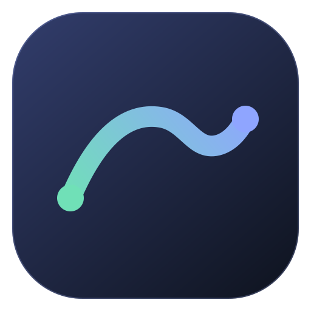
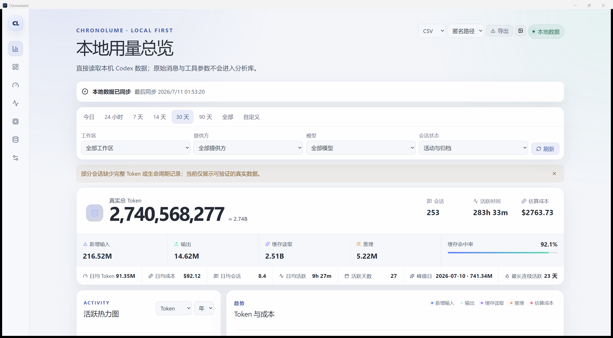
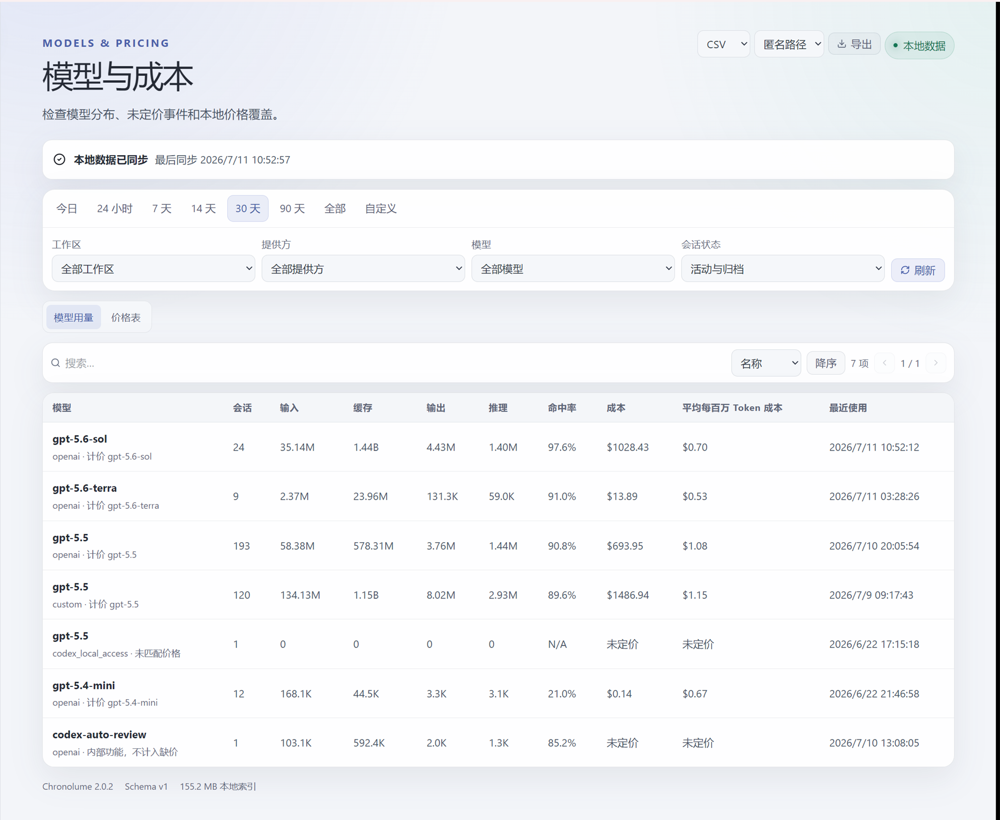
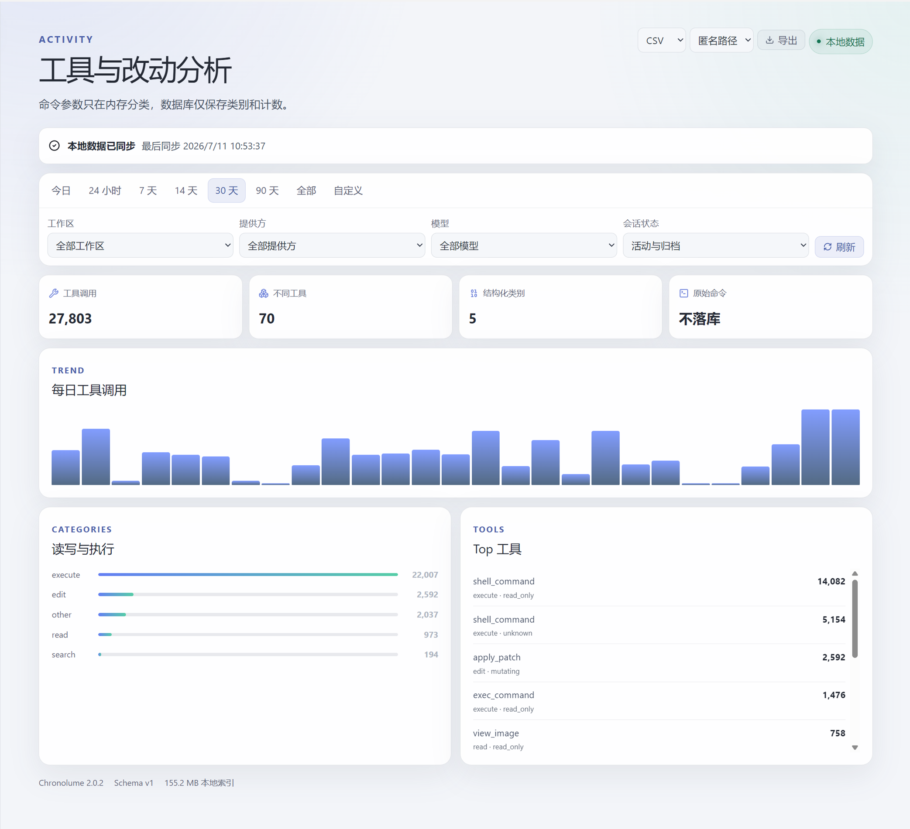

<p align="center">
  
</p>

<h1 align="center">Chronolume</h1>

<p align="center">
  <strong>让本地 Codex 数据，从一串日志变成你的工作节奏。</strong>
</p>

<p align="center"><em>Illuminate the rhythm of your work.</em></p>

<p align="center">
  <a href="https://github.com/gaos6e/Chronolume/releases/latest"></a>
  
  
  
</p>

<p align="center">
  <a href="https://github.com/gaos6e/Chronolume/releases/latest"><strong>下载最新版</strong></a>
  · <a href="docs/privacy.md">隐私边界</a>
  · <a href="docs/performance.md">性能数据</a>
</p>

Chronolume 是为 OpenAI Codex 用户打造的 Windows 与 macOS 本地洞察应用。它把散落在 `~/.codex` 中的活动记录，整理成直观的 Token、会话、活跃时间、模型、工具与成本趋势，让你看见一次次人机协作如何累积成真实的工作节奏。

它不是代理、抓包器或云端账号面板，更像一盏只照向本地数据的灯：不接管请求，不要求登录，不把数据上传到远端。安装后直接读取 Codex 已经写在本机的记录，在后台增量建立分析索引；日常打开即可查看，无需改变原有工作方式。

> [!NOTE]
> Chronolume 展示的成本来自 Token 用量与本地价格表的估算，不等同于 OpenAI 或 ChatGPT 的官方账单、余额或在线配额。

## 为什么是 Chronolume

<table>
  <tr>
    <td width="50%"><strong>📈 看见使用节奏</strong><br>从今天到全部历史，用趋势图、年度热力图和活跃时间还原工作强度，而不只是堆一串 Token 数字。</td>
    <td width="50%"><strong>💰 理解成本去向</strong><br>按提供方和模型拆分输入、输出、缓存与推理 Token，识别命中率、未定价事件和成本变化。</td>
  </tr>
  <tr>
    <td width="50%"><strong>🧭 从项目追到工具</strong><br>工作区、会话、模型和工具活动彼此关联；同一组筛选条件贯穿页面与导出，不必在多份表格之间来回拼数据。</td>
    <td width="50%"><strong>🔒 数据留在本机</strong><br>默认离线、无遥测、不读取账号凭据；提示词、回复、代码、命令与工具参数原文不会进入分析库。</td>
  </tr>
</table>

## 应用预览

<p align="center">
  <a href="docs/images/chronolume-dashboard.png">
    
  </a>
</p>

<table>
  <tr>
    <td width="50%" align="center" valign="top">
      <a href="docs/images/chronolume-models.png">
        
      </a>
      <br>
      <sub><b>模型与成本</b> · 模型分布、缓存命中率与本地价格覆盖</sub>
    </td>
    <td width="50%" align="center" valign="top">
      <a href="docs/images/chronolume-activity.png">
        
      </a>
      <br>
      <sub><b>工具与活动</b> · 每日调用趋势与隐私友好的结构化分类</sub>
    </td>
  </tr>
</table>

## 从下载到看见数据

1. Windows 用户前往 [GitHub Releases](https://github.com/gaos6e/Chronolume/releases/latest)，选择 NSIS 安装器或便携 ZIP。macOS 正式下载将在 Developer ID 签名、公证和真机验收完成后开放。
2. 启动 Chronolume。应用会以只读方式扫描 `~/.codex`，首次建立索引，之后只做增量同步。
3. 选择时间范围、工作区、提供方、模型和会话状态，开始查看或导出自己的 Codex 使用图景。

Windows x64 版本依赖 WebView2 Runtime。安装器尚未签名，在签名信誉建立前 Windows SmartScreen 可能显示提醒。macOS 2.1.0 阶段 A 只生成未签名 Universal `.app`/`.dmg` GitHub Actions artifact，不作为正式 Release；正式分发必须先完成 Developer ID 签名、Apple 公证、staple、Gatekeeper 验证和外部 Mac 验收。

## 核心能力

- **时间与筛选**：今日、24 小时、7/14/30/90 天、全部历史，以及固定或实时自定义范围；支持工作区、提供方、模型和归档状态级联筛选。
- **总览与趋势**：Token 构成、缓存命中率、会话数、估算成本、活跃时间、峰值日、连续活跃天数、年度热力图和小时/日/周趋势。
- **项目与会话**：工作区搜索、别名、忽略、上下文导航；会话级 Token、成本、活跃度、归档状态、完整性和最近 90 天结构化事件。
- **模型与价格**：模型分布、规范化计价 ID、未定价提示、本地价格增删改与恢复，以及用户主动触发的官方价格差异预览。
- **工具活动**：只保留搜索、读取、写入、编辑、执行和其他等结构化分类，展示 Top 工具与每日趋势，不落库命令正文。
- **本地数据管理**：后台首次导入、真实进度、取消、断点续传、增量同步、修复、重建、诊断与清空派生分析库。
- **体验与导出**：中英文、浅色/暗色/系统主题、字体缩放、reduced-motion，以及不含对话正文的 CSV、JSON 和 PNG 导出。

## 隐私从设计开始

Chronolume 对 `~/.codex` 只读，默认完全离线，无遥测、无后台上传、无代理，也不访问 `auth.json`。唯一可选的网络操作，是你主动发起的 OpenAI 官方价格检查；任何更新都必须先展示来源、时间与差异，再由你确认应用。

- 不查询或保存提示词、助手回复、标题、预览、首条用户消息、代码或命令正文。
- 工具参数只在内存中用于“搜索/读取/写入/编辑/执行/其他”分类，分类后立即丢弃。
- 不读取 `auth.json`、ChatGPT 在线配额或账号信息。
- CSV、JSON 与 PNG 导出不包含对话内容；结构化导出支持匿名路径和完整路径模式。

详细约束见 [docs/privacy.md](docs/privacy.md)。

## 数据位置与版本说明

分析数据库与应用设置保存在：

```text
Windows: %LOCALAPPDATA%\Chronolume\v2\chronolume-v2.sqlite3
macOS:   ~/Library/Application Support/Chronolume/v2/chronolume-v2.sqlite3
```

Windows 延续 2.0 的品牌数据迁移；macOS 不探测 Windows 历史应用目录。详见 [docs/migration-and-cleanup.md](docs/migration-and-cleanup.md)。清空分析库只会删除派生统计，不会修改 `~/.codex` 或用户导出文件。

## 开发与构建

Chronolume 2.1 使用 Tauri 2、Rust、React、TypeScript 与 Vite 构建。架构与数据模型说明见 [docs/architecture.md](docs/architecture.md) 和 [docs/data-model.md](docs/data-model.md)。

### 环境要求

- 通用：Node.js 22、npm、Rust stable（最低 1.85）。
- Windows：MSVC toolchain、Visual Studio Build Tools C++ workload、WebView2 Runtime。
- macOS：macOS 12+、Xcode Command Line Tools；Universal 构建需安装 `aarch64-apple-darwin` 与 `x86_64-apple-darwin` Rust targets。

### 本地开发

```powershell
npm ci
npm run dev
```

运行 Tauri 开发窗口：

```powershell
npm run tauri:dev
```

### 验证

```powershell
npm run typecheck
npm run lint
npm test
npm run build

Set-Location src-tauri
cargo fmt --check
cargo check
cargo clippy --all-targets --all-features -- -D warnings
cargo test
```

真实只读数据 benchmark：

```powershell
Set-Location src-tauri
cargo run --release --bin usage-benchmark -- "$HOME\.codex" "$env:LOCALAPPDATA\Chronolume\benchmarks\fresh.sqlite3"
```

benchmark 只读取 `~/.codex`，分析库写到显式指定路径。目标和实测结果见 [docs/performance.md](docs/performance.md)。

### 构建与打包

Windows：

```powershell
npm run tauri:build:windows
.\scripts\build-portable.ps1
```

macOS 未签名候选（只能在 macOS 上构建）：

```bash
rustup target add aarch64-apple-darwin x86_64-apple-darwin
npm run tauri:build:macos -- --no-sign --ci
```

Windows 产物路径、哈希和 smoke test 见 [docs/packaging.md](docs/packaging.md)；macOS Universal 候选、签名门禁和验证流程见 [docs/packaging-macos.md](docs/packaging-macos.md)。
